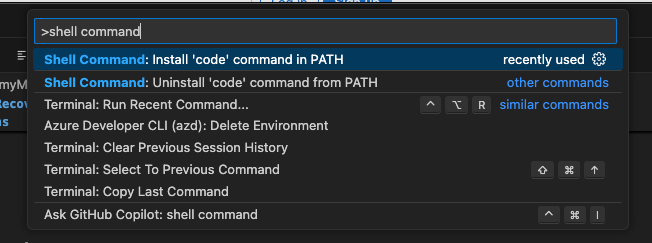
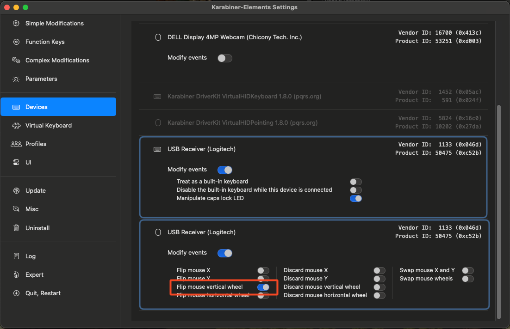
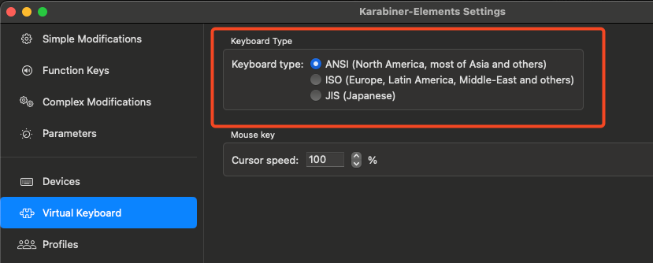

# my MacBook Setup for Disaster Recovery

Nobody needs backup, everyone needs recovery. Disasters always strike when you least expect them. That’s why being prepared is crucial. With this README, I’m documenting my recovery process to ensure a faster setup in case it happens again.

Recently, my MacBook had an issue out of nowhere—Intune Management no longer recognized my device. After multiple attempts to re-enroll it, I decided to reinstall from scratch. While doing so, I documented all necessary settings to get up and running again. Here’s my result.

## Install Apps

I install most of my apps using Homebrew via the command line.

- Microsoft PowerPoint
- Company Portal
- Microsoft Teams
- GarageBand
- Microsoft Word
- OneDrive
- Karabiner-EventViewer
- Publer
- Microsoft Defender
- Safari
- Microsoft Edge
- Microsoft Excel
- Microsoft OneNote
- Visual Studio Code
- Microsoft Outlook
- Shottr
- Signal
- The Unarchiver
- Visual Studio Code

### Automating with Homebrew

I use Homebrew to automate the installation process.

1. Install Homebrew:

   ```bash
   /bin/bash -c "$(curl -fsSL https://raw.githubusercontent.com/Homebrew/install/HEAD/install.sh)"
   ```

2. Install packages from a predefined list:

   Update this list regularly as you install new apps.

   ```bash
   brew install $(cat packages.txt)
   ```

   Here is my baseline [packages.txt](./packages.txt)

## Visual Studio Code Extensions

I use VS Code for writing blog posts, scripting, and Infrastructure as Code (IaC). Here are my essential extensions. I automate the installation using VS Code CLI (see below).

- .NET Install Tool
- Azure Account
- Azure CLI Tools
- Azure Developer CLI
- Azure PowerShell Tools
- Azure Resource Manager (ARM) Tools
- Azure Resources
- Azure Terraform
- Bicep
- GitHub Copilot
- GitHub Copilot Chat
- GitHub Copilot for Azure
- HashiCorp Terraform
- Learn Authoring Pack
- Learn Training AI Assistant
- Learn Article Templates
- Learn Images
- Learn Markdown
- Learn Preview
- Learn Scaffolding
- Learn YAML
- Markdownlint
- YAML

### Automation with VS Code CLI

If VS Code CLI is not present yet install it by opening VS Code and typing **CMD + Shift + P**. Enter the following command

```bash
shell command
```


Here is an image of that

After that you can install the extions via VS Code CLI using the following command:

```bash
cat vscode-extensions.txt | while read extension || [[ -n $extension ]];
do
  code --install-extension $extension --force
done
```

Here is my list of extensions: [vscode-extensions.txt](./vscode-extensions.txt)

## Browser Extensions

Since I use Edge as my main browser, my extensions and bookmarks sync automatically.

## Configuration Files

Most Mac preferences and application settings are stored in **plist** files. I recommend backing these up to retain settings after a reinstall. You can find them under:

```bash
~/Library/Preferences/
```

I use **Time Machine** backups with an external SSD to keep my settings and more up to date.

## Karabiner Elements

I use **Karabiner Elements** mainly for three reasons:

1. **Mouse and Trackpad**  
   By default, macOS applies the same scrolling settings to both, mouse and trackpad. If I enable *Natural Scrolling* for my trackpad, my mouse wheel scrolls in the wrong direction. Karabiner Elements allows me to reverse the mouse wheel independently.
   

2. **Keyboard Layout**  
   I’ve encountered issues where the keyboard layout changed from ISO to ANSI, flipping keys like `^°` and `<>`. Karabiner Elements ensures my external keyboard doesn’t alter my local layout.
   

3. **Home and End Keys**  
   I prefer using the *Home* and *End* keys to navigate lines efficiently. These settings enable this functionality on a standard keyboard.

   You can find my configurations here: [karabiner-elements](./karabiner-elements/)

## Conclusion

After resetting my device, I was fully operational again within **two hours**. This setup ensures I can recover quickly and efficiently next time.
